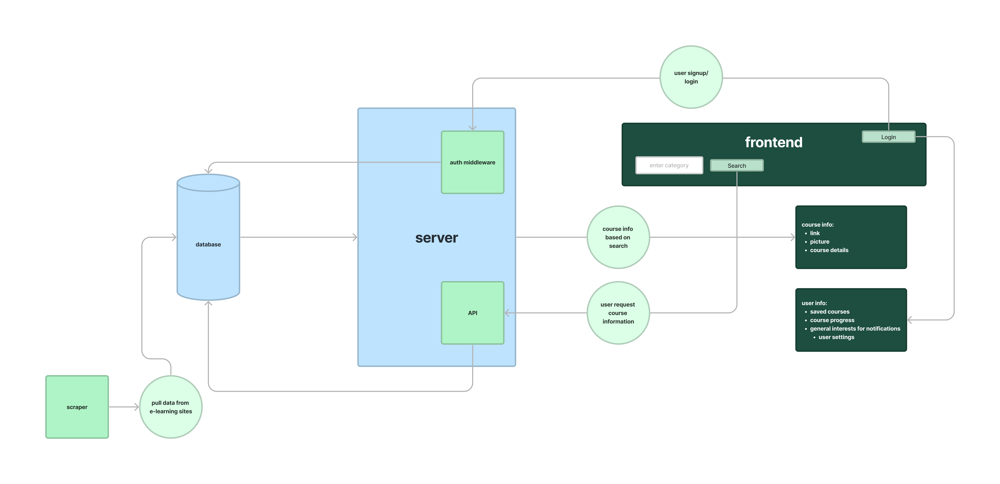
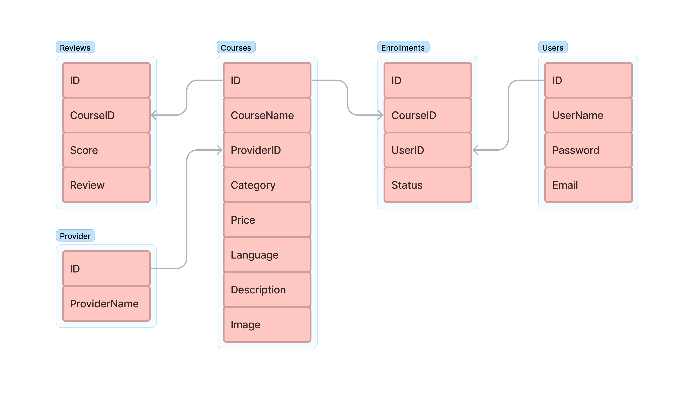
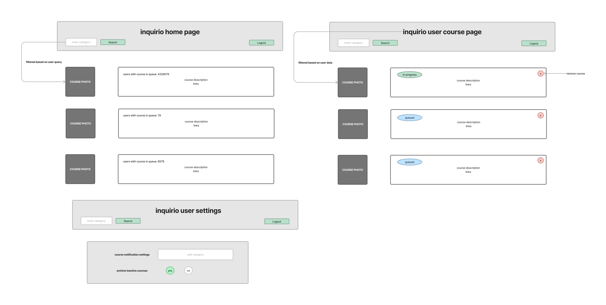

# Inquirio

## User Stories

[User Stories Project Board](https://github.com/orgs/inquirio/projects/1)

## Software Requirements

[Software Requirements](./Documentation/requirements.md)

## Domain Modeling



## Database Schema



## Wireframe



## Developer Notes

We use [Prisma](https://www.prisma.io/) as our ORM.  
To create a local version for development, perform the following steps; do not run these commands in the production environment.

- Ensure that you are running node version 15 or later
- Ensure that you have Postgres running on your local machine.
- Create a `.env` file in the root directory of the cloned repository. Place the following line inside the file, replacing the bracketed values with your Postgres username and password (if necessary).
  
  ```env
    DATABASE_URL=postgresql://<username>:<password>@localhost:5432/inquirio?schema=public
  ```

- Run the following commands in your terminal from the root of the repository.

  ```bash
    npm i
    npx prisma migrate dev
  ```
